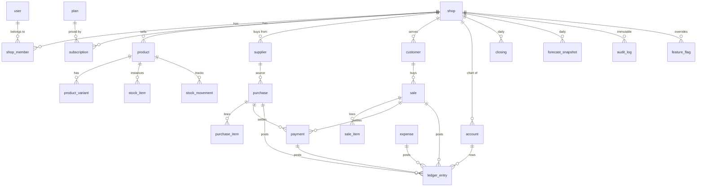
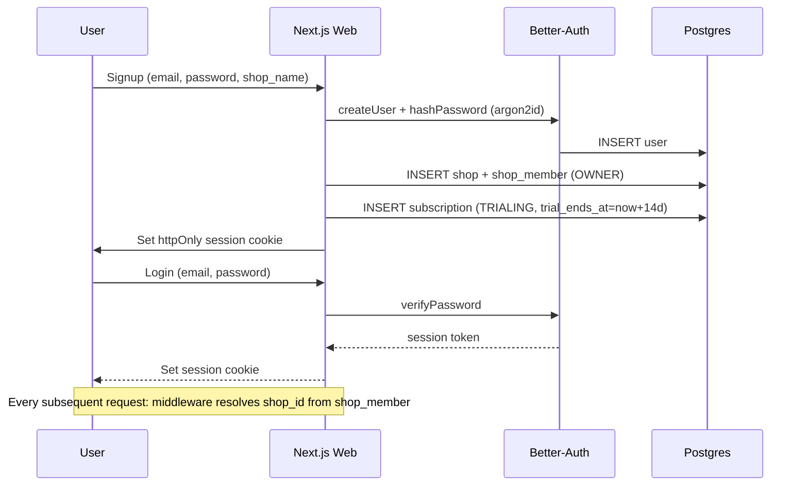
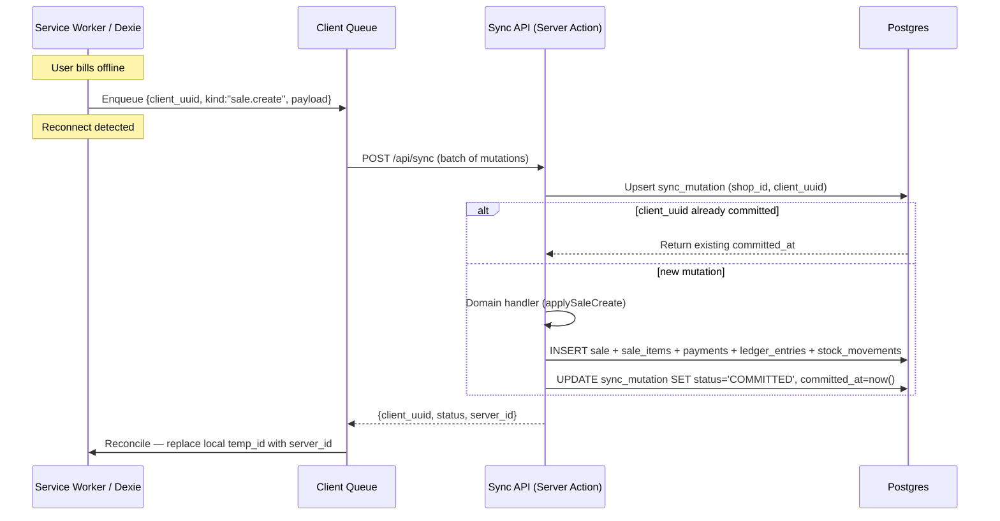
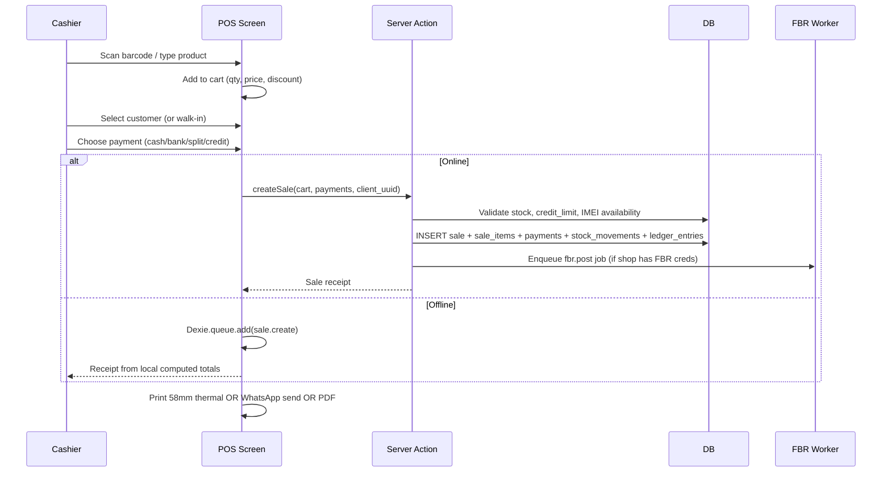
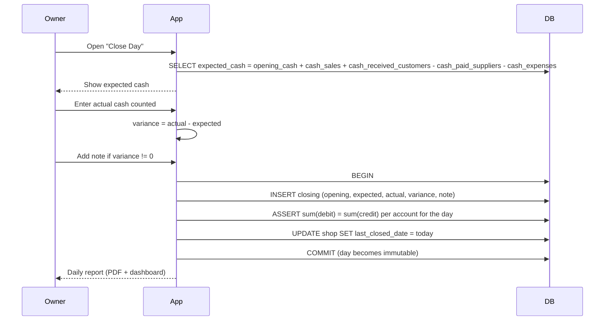
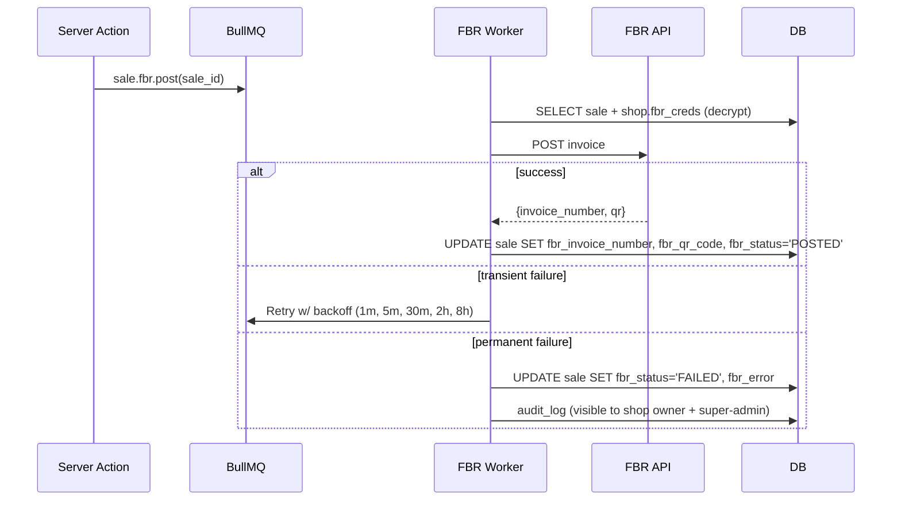
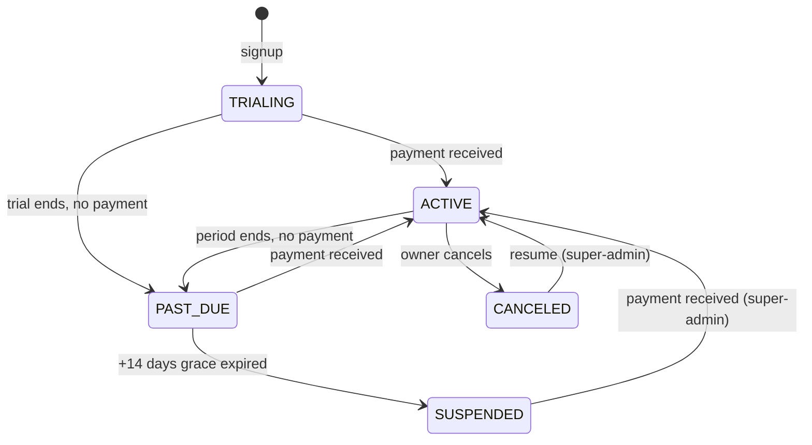

# ShopOS — Technical Specification

> Authoritative technical spec. Anchor: [CLAUDE.md](CLAUDE.md). Delivery timeline: [ROADMAP.md](ROADMAP.md). VPS bootstrap: [SETUP.md](SETUP.md).

## 1. Multi-tenancy model

### 1.1 Strategy
Shared database, shared schema, `shop_id` column on every tenant table, **Postgres Row-Level Security (RLS)** as the enforcement boundary. This is the same pattern used by Supabase, Linear, and most modern B2B SaaS. It avoids the connection-pool + migration nightmare of schema-per-tenant, while guaranteeing that even a buggy query cannot leak across tenants.

### 1.2 Hierarchy
```
Platform (super-admin)
└── Shop (tenant)
    ├── Branches (optional, Phase 2)
    └── Users (via shop_member: OWNER | MANAGER | CASHIER | ACCOUNTANT | VIEWER)
```

### 1.3 Request lifecycle
```mermaid
sequenceDiagram
  participant C as Client
  participant N as Next.js Server Action
  participant DB as Postgres
  C->>N: Request w/ session cookie
  N->>N: Resolve shop_id from session (shop_member)
  N->>DB: BEGIN; SET LOCAL app.current_shop_id='<uuid>'
  N->>DB: Prisma query (RLS applies)
  DB-->>N: Rows filtered by policy
  N->>DB: COMMIT
  N-->>C: Response
```

Every authenticated request opens a transaction, sets `app.current_shop_id`, runs queries, commits. If the session has no active shop (e.g. super-admin), the setting is left unset and queries against RLS tables return zero rows (deny by default).

### 1.4 Super-admin bypass
Super-admin uses a separate DB role created with `BYPASSRLS`. This role is only used by explicit super-admin code paths (`/admin/*` routes + impersonation). Every bypass writes to `audit_log` with the acting user, reason, and IP.

## 2. Data model

### 2.1 ER diagram



### 2.2 Invariants
| # | Invariant | Enforced by |
|---|-----------|-------------|
| I1 | `SUM(stock_movement.qty_delta)` per (shop, product) = count of `stock_item WHERE status='IN_STOCK'` | DB trigger on `stock_movement` + domain test |
| I2 | For each sale: `SUM(payment.amount WHERE sale_id=X) + sale.credit_amount = sale.total` | Domain layer + DB check constraint on posted sales |
| I3 | Per (shop, date): `SUM(ledger_entry.debit) = SUM(ledger_entry.credit)` | Closing job asserts; test suite guards |
| I4 | No negative stock unless `shop.allow_negative_stock` | Domain layer + stored function `fn_reserve_stock` |
| I5 | `(shop_id, imei)` unique; `(shop_id, serial)` unique | DB unique index |
| I6 | Sales in a closed day are read-only | Trigger on `sale`: block UPDATE/DELETE if `closing` exists for sale's day |
| I7 | Every super-admin cross-tenant read/write writes to `audit_log` | Middleware wrapper + code review |

### 2.3 Entities (abbreviated column list — full Prisma schema generated in Phase 0)

Global (not tenant-scoped):
- `user(id, email, email_verified_at, password_hash, name, phone, role, created_at)` — `role` in (`USER`, `SUPER_ADMIN`)
- `shop(id, name, address, ntn, gst, timezone='Asia/Karachi', currency='PKR', allow_negative_stock=false, default_tax_rate, fbr_pos_id_encrypted, fbr_api_key_encrypted, trial_ends_at, status, created_at)`
- `shop_member(user_id, shop_id, role, created_at)` — roles: `OWNER | MANAGER | CASHIER | ACCOUNTANT | VIEWER`
- `plan(id, code, name, price_pkr, interval, is_lifetime)`
- `subscription(id, shop_id, plan_id, status, trial_ends_at, current_period_end, created_at)` — status: `TRIALING | ACTIVE | PAST_DUE | CANCELED | SUSPENDED`
- `feature_flag(shop_id, key, value_jsonb)`
- `audit_log(id, created_at, actor_user_id, actor_role, shop_id, impersonated_shop_id, action, target_table, target_id, before_jsonb, after_jsonb, ip, user_agent, reason)` — append-only, partitioned monthly

Tenant-scoped (every table: `shop_id UUID NOT NULL` + RLS):
- `product(id, shop_id, sku, name, category, brand, model, unit, has_imei, has_serial, has_warranty, cost, price, tax_rate, barcode, low_stock_threshold, reorder_qty, is_active)`
- `product_variant(id, shop_id, product_id, color, storage, ram, cost_override, price_override)`
- `stock_item(id, shop_id, product_id, variant_id, imei, serial, status, acquired_at)` — status: `IN_STOCK | SOLD | RETURNED | DAMAGED`
- `stock_movement(id, shop_id, product_id, variant_id, stock_item_id?, qty_delta, reason, ref_table, ref_id, created_at, created_by)`
- `supplier(id, shop_id, name, phone, address, ntn, opening_balance, notes)`
- `purchase(id, shop_id, supplier_id, invoice_no, purchased_at, subtotal, tax, total, notes, client_uuid)`
- `purchase_item(id, shop_id, purchase_id, product_id, variant_id?, qty, unit_cost, line_total)`
- `customer(id, shop_id, name, phone, cnic, opening_balance, credit_limit, notes)`
- `sale(id, shop_id, customer_id?, cashier_user_id, sold_at, subtotal, discount, tax, total, credit_amount, fbr_invoice_number?, fbr_qr_code?, fbr_status, client_uuid)` — fbr_status: `NONE | PENDING | POSTED | FAILED`
- `sale_item(id, shop_id, sale_id, product_id, variant_id?, stock_item_id?, qty, unit_price, unit_cost, discount, tax, line_total)`
- `payment(id, shop_id, sale_id?, purchase_id?, party_type, party_id?, method, amount, paid_at, note, client_uuid)` — method: `CASH | BANK | JAZZCASH | EASYPAISA | CARD | CHEQUE`
- `account(id, shop_id, code, name, type)` — types: `ASSET | LIABILITY | EQUITY | INCOME | EXPENSE`
- `ledger_entry(id, shop_id, entry_date, account_id, debit, credit, ref_table, ref_id, memo)`
- `expense(id, shop_id, category, amount, paid_at, account_id, note)`
- `closing(id, shop_id, closing_date, opening_cash, expected_cash, actual_cash, variance, notes, closed_by, closed_at)` — unique(shop_id, closing_date)
- `forecast_snapshot(id, shop_id, product_id, snapshot_date, avg_daily_sales_7d, avg_daily_sales_30d, current_stock, days_of_stock_remaining, reorder_point, reorder_suggested)`
- `sync_mutation(id, shop_id, client_uuid, user_id, kind, payload_jsonb, client_created_at, committed_at, status, error)` — idempotency log; unique(shop_id, client_uuid)

## 3. RLS policies

### 3.1 Policy template
For every tenant-scoped table:
```sql
ALTER TABLE <table> ENABLE ROW LEVEL SECURITY;
ALTER TABLE <table> FORCE ROW LEVEL SECURITY;

CREATE POLICY tenant_isolation ON <table>
  USING  (shop_id = current_setting('app.current_shop_id', true)::uuid)
  WITH CHECK (shop_id = current_setting('app.current_shop_id', true)::uuid);
```

`FORCE` applies the policy even to the table owner (Prisma's connection role) — without it, a misconfigured role bypasses RLS. `current_setting(..., true)` returns `NULL` if unset, which fails the policy and denies all rows (safe default).

### 3.2 Super-admin role
```sql
CREATE ROLE shopos_admin WITH LOGIN BYPASSRLS PASSWORD :'pw';
-- used only by /admin/* code path via a second PrismaClient instance
```
Application code keeps two Prisma clients:
- `prisma` (tenant role, RLS-enforced) — default
- `prismaAdmin` (bypass role) — imported only in `/admin` modules, wrapped by `withAudit(...)` middleware that records before/after snapshots

### 3.3 CI proof
`packages/db/test/rls.spec.ts` runs against a fresh test DB:
1. Create two shops A and B, each with a user.
2. Insert products, customers, sales under each shop.
3. Open a session for user A; run queries; assert zero rows from shop B visible via any entrypoint (findMany, findUnique, raw SQL).
4. Attempt UPDATE/DELETE of B's rows as A; assert zero rows affected.
5. Repeat for every tenant-scoped table via a test harness that iterates Prisma's DMMF.

This test blocks the PR if red.

## 4. Auth flow



- Passwords: argon2id, min 10 chars, pwned-password check (HIBP k-anonymity) on signup + reset
- Sessions: httpOnly + Secure + SameSite=Lax cookies, 30-day rolling
- Password reset: email magic link (stub in P0, live with Resend/SMTP in P1)
- Rate limits: 10 login attempts / 15 min / IP (Redis)
- Phone OTP: deferred to Phase 2 (Twilio)

## 5. Offline sync flow



**Rules:**
- Every client-side mutation carries a `client_uuid` generated with `crypto.randomUUID()` before going offline.
- Server upserts by `(shop_id, client_uuid)` — duplicate deliveries are no-ops.
- Sales and payments are **immutable once committed**. Amendments require a separate reversal entry.
- Stock adjustments **merge additively**: two offline adjustments of -1 each on the same item result in a net -2 after sync (resolved at the movement layer, not the item layer).
- Closing **cannot happen offline by design** — it reconciles cash physically counted vs server-computed, which requires authoritative server state.

**Dexie schema (client):**
```
db.products      — replicated catalog (products + variants)
db.customers     — replicated customer directory
db.queue         — pending mutations {client_uuid, kind, payload, created_at, attempts, status}
db.cache         — last dashboard snapshot for offline viewing
```

## 6. Billing / POS flow



**Credit sale guard:** if `payment.method = CREDIT` (i.e. credit_amount > 0), customer must exist AND `customer.outstanding + sale.total <= customer.credit_limit`. On breach: block with PIN override (OWNER role only).

**Perf target:** add-to-cart tap→render < 150ms; full bill commit (online) < 500ms; offline commit < 50ms.

## 7. Closing flow



**Expected cash formula:**
```
expected_cash =
    opening_cash (from previous closing, or shop.opening_cash if first day)
  + SUM(payment.amount WHERE method=CASH AND sale_id IS NOT NULL AND paid_at in [day])
  + SUM(payment.amount WHERE method=CASH AND party_type=CUSTOMER AND paid_at in [day])
  - SUM(payment.amount WHERE method=CASH AND party_type=SUPPLIER AND paid_at in [day])
  - SUM(payment.amount WHERE method=CASH AND purchase_id IS NOT NULL AND paid_at in [day])
  - SUM(expense.amount WHERE paid_via_cash=true AND paid_at in [day])
```

All `[day]` ranges resolve in `Asia/Karachi`. Server stores UTC; boundaries computed in PKT.

**Reversal:** a closed day is immutable. Reversing requires super-admin action, logs an `audit_log` entry, soft-nullifies the closing row (`reversed_at, reversed_reason`), and creates a new closing the next time the owner closes.

## 8. API contracts (Phase 0–1)

All writes are **Server Actions** (colocated with the page). Reads are RSC or route handlers for JSON endpoints. Key signatures:

```ts
// packages/core/src/billing
createSale(input: {
  cart: Array<{ product_id: string; variant_id?: string; qty: number; unit_price: number; discount?: number; imei?: string; serial?: string }>;
  customer_id?: string;
  payments: Array<{ method: PaymentMethod; amount: number }>;
  credit_amount?: number;
  client_uuid: string;
}): Promise<{ sale_id: string; fbr_enqueued: boolean }>;

// packages/core/src/inventory
adjustStock(input: {
  product_id: string; variant_id?: string; qty_delta: number;
  reason: StockReason; note?: string; client_uuid: string;
}): Promise<{ movement_id: string }>;

// packages/core/src/closing
closeDay(input: {
  actual_cash: number; note?: string;
}): Promise<{ closing_id: string; expected: number; variance: number }>;

// packages/core/src/sync
applyMutations(batch: SyncMutation[]): Promise<SyncResult[]>;
```

Route handlers (minimal set):
- `POST /api/sync` — offline flush
- `POST /api/webhooks/fbr` — FBR callbacks
- `GET  /api/invoices/:sale_id.pdf` — signed URL or streamed PDF
- `GET  /health` — liveness

## 9. Forecasting

**Phase 1 (simple, sufficient):** nightly job computes per `(shop_id, product_id)`:
```
avg_daily_sales_7d  = qty_sold_last_7d  / 7
avg_daily_sales_30d = qty_sold_last_30d / 30
current_stock       = count(stock_item WHERE status='IN_STOCK')
days_of_stock_remaining = current_stock / max(avg_daily_sales_7d, 0.01)
lead_time_days      = product.lead_time_days (default 7)
safety_stock        = ceil(avg_daily_sales_7d * 2)    // 2-day buffer
reorder_point       = ceil(avg_daily_sales_7d * lead_time_days) + safety_stock
reorder_suggested   = current_stock <= reorder_point
```
Stored in `forecast_snapshot` keyed by `(shop_id, product_id, snapshot_date)`. Dashboard reads the latest row.

**Dead stock:** `no sales in last 60d AND current_stock > 0`.

**Phase 2:** add weekly seasonality (day-of-week adjustment; Eid window booster).

**Phase 3:** Prophet microservice (Python, gRPC) if shops have >1 year of history.

## 10. FBR integration

Each **shop** holds its own FBR POS Integration credentials. Platform never holds a master POS ID.

**Storage:** `shop.fbr_pos_id_encrypted`, `shop.fbr_api_key_encrypted` — AES-256-GCM with a key in `FBR_ENCRYPTION_KEY` env var. Decrypt only inside the worker; never surfaced to the web app.

**Flow:**

Invoice PDF template always renders the QR if `fbr_qr_code` is set, otherwise "FBR pending".

## 11. Subscription lifecycle



- `SUSPENDED` shops cannot bill; app shows a paywall. Data retained 90 days, then archived.
- Super-admin can extend trial, waive grace period, apply discounts.

## 12. Tax model

During onboarding the wizard asks: **"Are you FBR-registered?"**
- **Yes** → default `product.tax_rate = 18%`, shop becomes eligible for FBR POS integration (requires FBR POS ID in Settings).
- **No** → default `product.tax_rate = 0%`. Shop can opt in later.

Per-product override always wins. Tax is computed line-by-line on sale, stored on `sale_item.tax`, summed to `sale.tax`. The **Tax Summary** report rolls up output tax, input tax (from purchase_items), and payable.

## 13. Audit log

Append-only, never updated, never deleted. Partitioned monthly (`audit_log_2026_01`, etc.) via pg_partman once volume grows.

**What is logged:**
- Every super-admin action (including read of tenant data)
- Impersonation: start, end, every request during the session (banner flagged in UI, visible to shop owner on return)
- Sensitive tenant actions: sale delete/reverse, price edits, discount above threshold, cost-price views by non-owner, stock adjustments with reason=DAMAGE, closing reversal, user role change
- Auth: password reset, login from new device

**Super-admin impersonation:** max 60 min, requires typed reason, session banner-flagged. Shop owner receives a notification email + in-app banner on return.

## 14. Backup & disaster recovery

**Nightly (03:00 PKT):** `pg_dump -Fc` to `/var/backups/shopos/shopos_<YYYY-MM-DD>.dump`. Retention: 14 daily + 8 weekly + 6 monthly locally. Optional R2/B2 uploader controlled by `BACKUP_REMOTE=r2|b2|none`.

**Restore drill:** once per quarter, restore latest dump into staging container; run smoke tests (auth works, a sale can be created, RLS still isolates). Log result.

**Point-in-time recovery:** add WAL archiving in Phase 2 once data matters more than a 24-hour RPO.

## 15. Feature flags

Per-shop override table `feature_flag(shop_id, key, value_jsonb)`. Defaults live in code (`packages/core/src/flags.ts`). Super-admin UI can toggle per-shop. Examples: `enable_fbr`, `enable_whatsapp_auto`, `enable_multi_branch` (P2), `enable_prophet_forecast` (P3).

## 16. Non-functional targets

| Metric | Target |
|--------|--------|
| TTFB dashboard (cached) | < 300ms |
| Billing add-to-cart | < 150ms |
| Offline sale commit | < 50ms |
| Sync 100 pending mutations | < 3s |
| App cold start on mid-range Android | < 2s |
| Lighthouse PWA score | ≥ 90 |
| CI (lint + typecheck + test + RLS) | < 4 min |

## 17. Security checklist (Phase 0)

- [ ] argon2id password hashing (Better-Auth default)
- [ ] httpOnly + Secure + SameSite=Lax session cookies
- [ ] CSRF: Server Actions built-in + double-submit cookie for route handlers
- [ ] Rate limits (Redis): 100/min IP, 300/min user, 10/15min login
- [ ] RLS on every tenant table + CI test
- [ ] `FORCE ROW LEVEL SECURITY` on every tenant table
- [ ] Secrets only in env; `.env` gitignored; `.env.example` tracked
- [ ] Super-admin on separate DB role with BYPASSRLS
- [ ] Impersonation banner + audit trail + 60-min cap
- [ ] Signed S3 URLs for invoice PDFs (30-min expiry)
- [ ] VPS: UFW (only 22, 80, 443), fail2ban, non-root deploy user, SSH key-only — see [SETUP.md](SETUP.md)
